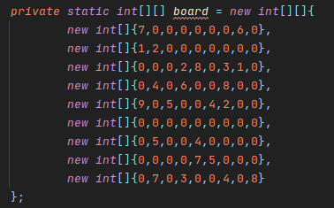
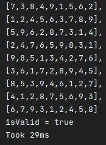

# SudokuSolver
This is a java program that solves sudokus by checking all possibilities for each number until it finds a solution

## How to use
To use this program you have to put your own board in src/xyz/micrusa/sudoku/Solver.class and run Main class, it will solve it and tell how much milliseconds it took to solve it

## Example
<b>Board:</b>
 
 <b>Ouput:</b>
 